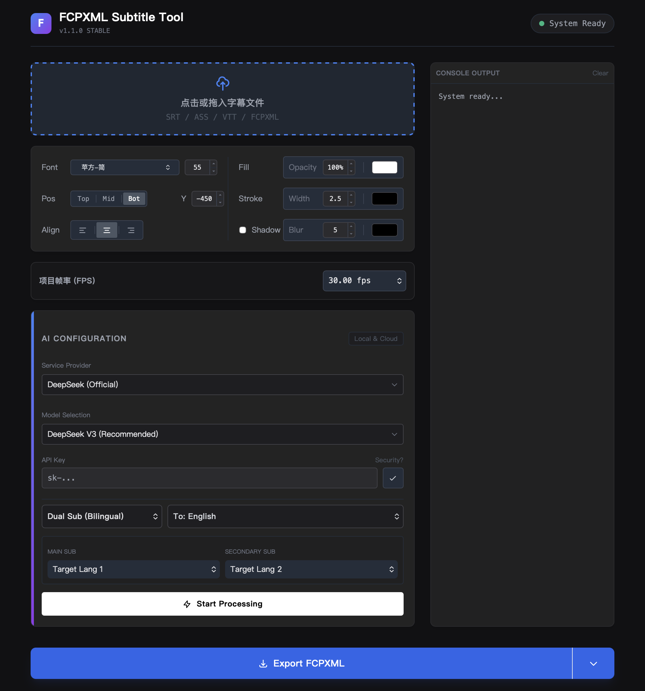

# 🎬 FCPXML Subtitle Tool Pro

   

**[English](#english) | [中文说明](#中文说明)**

---

## 🇬🇧 English

A professional, privacy-first web tool designed for **Final Cut Pro** editors. Convert standard subtitles (SRT/VTT/ASS) into FCPXML with AI-powered translation, polishing, and bilingual layout support.

**✨ Client-side only. No server backend. Your API Key is safe.**

### 🖼️ Preview

### 🚀 Key Features

* **多格式支持 (Multi-Format)**: Seamlessly convert `.srt`, `.vtt`, `.ass`, `.ssa` to `.fcpxml`.
* **🤖 AI Integration**:
    * **Cloud**: Support **DeepSeek-V3 / R1** (via API).
    * **Local**: Support **Ollama** (e.g., Qwen 2.5) for offline privacy.
* **双语模式 (Bilingual Mode)**: Automatically generate "Chinese (Top) + English (Bottom)" dual subtitles.
* **🎨 Pro UI**: Dark mode interface designed for editors, with precise layout control.
* **Privacy First**: All logic runs in your browser. No data is uploaded to any 3rd-party server (except the AI API you choose).

### 🛠️ Quick Start

#### Option 1: Online Usage (Recommended)
Visit the GitHub Pages link:
> **[🔗 Click here to open FCPXML Subtitle Tool](https://benniechenbin.github.io/fcpxml-subtitle-tool/)**
> *(Replace this link after you activate GitHub Pages)*

#### Option 2: Run Locally
1.  Clone or download this repository.
2.  Open `index.html` directly in Chrome / Safari / Edge.
3.  No Node.js or Python environment required.

### ⚙️ Configuration

* **API Key**: Enter your DeepSeek API Key in the settings panel. It is stored in memory only.
* **Local Model**: Ensure your Ollama is running (`ollama serve`) and allow CORS if necessary.

### ⚠️ Known Limitations (Important)

**Regarding Complex Timelines:**
This tool generates a "clean" subtitle sequence. It does **not** support parsing complex FCPXML exported from projects containing:
* Compound Clips
* Retiming (Speed Ramping)
* Multicam Clips

**✅ Best Practice Workflow:**
1.  In Final Cut Pro, select your subtitles (or create a Gap clip).
2.  Copy them to a **New, Empty Project**.
3.  Export XML from that new project.
4.  Process with this tool.
5.  Drag the generated `.fcpxml` back into your main timeline.

---

## 🇨🇳 中文说明

专为 Final Cut Pro 剪辑师打造的硬核字幕工具。支持将 SRT/VTT/ASS 字幕转换为 FCPXML，并内置 DeepSeek/Ollama 接口，实现 AI 自动翻译、润色及双语字幕排版。

**✨ 纯本地运行。无后端服务器。你的 API Key 绝对安全。**

### 🚀 核心功能

* **全格式转换**: 支持 `.srt`, `.vtt`, `.ass`, `.ssa` 转 `.fcpxml`。
* **🤖 AI 智能引擎**:
    * **云端**: 完美支持 **DeepSeek-V3 / R1** (需填 API Key)。
    * **本地**: 支持 **Ollama** (如 Qwen 2.5)，零成本离线运行。
* **双语对照**: 一键生成「上中文大字 + 下英文小字」的标准双语字幕。
* **🎨 专业界面**: 极客风深色模式，支持自定义字体（苹方/冬青）、字号、描边及垂直位置。
* **隐私保护**: 所有代码均在浏览器本地运行，除了你调用的 AI 接口外，不经过任何第三方服务器。

### 🛠️ 如何使用

#### 方法一：在线使用 (推荐)
直接访问 GitHub Pages 页面：
> **[🔗 点击这里使用 FCPXML Subtitle Tool](https://benniechenbin.github.io/fcpxml-subtitle-tool/)**
> *(请在 GitHub 设置 Pages 后替换此链接)*

#### 方法二：本地运行
1.  下载本仓库代码 (`Code` -> `Download ZIP`)。
2.  解压后，双击 `index.html` 直接运行。
3.  无需安装 Python 或 Node.js 环境。

### ⚙️ 配置指南

* **API Key**: 在工具界面填入你的 DeepSeek API Key。Key 仅在本地使用，刷新页面即焚。
* **本地模型**: 如果使用 Ollama，请确保本地服务已启动 (`ollama serve`)，并配置了允许跨域 (CORS)。

### ⚠️ 局限性说明 (必读)

**关于复杂时间线：**
本工具生成的 XML 是标准化的扁平结构。**不支持**直接解析包含以下内容的复杂 FCPXML：
* 复合片段 (Compound Clips)
* 变速处理 (Retiming)
* 多机位片段 (Multicam)

**✅ 推荐工作流 (Best Practice):**
1.  在 FCP 中选中所有需要处理的字幕。
2.  复制 (`Cmd+C`) 并粘贴 (`Cmd+V`) 到一个**新的、空白的项目 (Project)** 中。
3.  导出这个新项目的 XML 供本工具使用。
4.  将生成的 `.fcpxml` 拖回原剪辑的时间轴上方即可。

### 📄 License

MIT License. Free for everyone.
