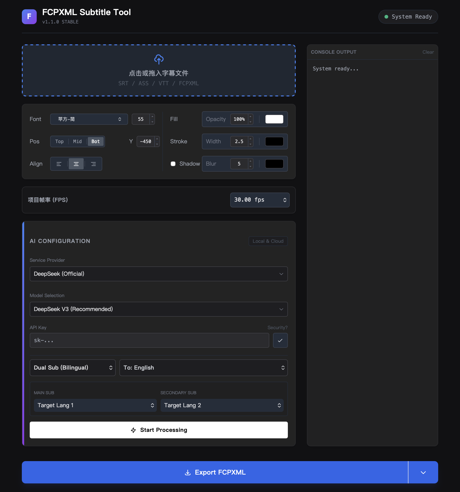

# 🎬 AI Subtitle Master for FCPXML

   

**[English](#english) | [中文说明](#中文说明)**

---
### 🖼️ Preview

---

## 🇬🇧 English

A professional, privacy-first web tool designed for **Final Cut Pro** editors. Convert standard subtitles (SRT/VTT/ASS) into FCPXML with AI-powered translation, polishing, and flexible bilingual layout support.

**✨ Client-side only. No server backend. Your API Key is safe.**

### 🚀 Key Features

* **Multi-Format Support**: Seamlessly convert `.srt`, `.vtt`, `.ass`, `.ssa` to `.fcpxml`.
* **🤖 AI Integration**:
    * **Cloud**: **DeepSeek** (V3/R1), **OpenAI** (GPT-4o/Mini).
    * **Local**: **Ollama** (e.g., Qwen 2.5, Llama 3) for offline privacy.
    * **Custom**: Compatible with OneAPI / NewAPI endpoints.
* **🌍 Multi-Language & Dual Translation (New!)**:
    * **Global Support**: Translate between English, Chinese, Japanese, Korean, French, German, etc.
    * **Dual Translation**: Translate source text into **two different languages** simultaneously (e.g., Source English -> Main Chinese + Sub Japanese).
    * **Flexible Layout**: Independently configure Main and Secondary subtitles (Source / Target 1 / Target 2).
* **✨ Polish Mode**: Rewrite rigid translations or transcripts into natural, spoken language.
* **🎨 Pro UI**: Dark mode interface designed for editors, with precise layout control.

### 🛠️ Quick Start

#### Option 1: Online Usage (Recommended)
> **[🔗 Click here to open AI Subtitle Master](https://benniechenbin.github.io/fcpxml-subtitle-tool/)**

#### Option 2: Run Locally
1.  Clone or download this repository.
2.  Open `index.html` directly in Chrome / Safari / Edge.
3.  No Node.js or Python environment required.

### ⚙️ Configuration

* **API Key**: Enter your DeepSeek/OpenAI API Key. It is stored in browser memory only and cleared on refresh.
* **Local Model**: Ensure your Ollama is running (`ollama serve`) and allow CORS if necessary.

### ⚠️ Known Limitations & Best Practice

**Regarding Complex Timelines:**
This tool generates a "clean" subtitle sequence. It does **not** support parsing complex FCPXML exported from projects containing Compound Clips, Retiming, or Multicam Clips.

**✅ Recommended Workflow:**
1.  In Final Cut Pro, select your subtitles (or create a Gap clip).
2.  Copy them to a **New, Empty Project**.
3.  Export XML from that new project.
4.  Process with this tool.
5.  Drag the generated `.fcpxml` back into your main timeline.

### ⚖️ Disclaimer

1.  **No Warranty**: This software is provided "as is", without warranty of any kind.
2.  **User Responsibility**: You are responsible for keeping your API Keys secure. The developer is not liable for any financial loss due to key leakage.
3.  **Compliance**: Please adhere to the terms of service of the respective AI providers.

---

## 🇨🇳 中文说明

专为 Final Cut Pro 剪辑师打造的硬核字幕工具。支持将 SRT/VTT/ASS 字幕转换为 FCPXML，并内置 DeepSeek/OpenAI 接口，实现 AI 自动翻译、润色及任意双语字幕排版。

**✨ 纯本地运行。无后端服务器。你的 API Key 绝对安全。**

### 🚀 核心功能

* **全格式转换**: 支持 `.srt`, `.vtt`, `.ass`, `.ssa` 转 `.fcpxml`，自动修复帧率漂移。
* **🤖 AI 智能引擎**:
    * **云端**: 完美支持 **DeepSeek** (V3/R1) 和 **OpenAI** (GPT-4o/Mini)。
    * **本地**: 支持 **Ollama** (如 Qwen 2.5)，零成本离线运行，隐私无忧。
    * **自定义**: 支持 OneAPI 等中转服务地址。
* **🌍 多语种与双重翻译 (New!)**:
    * **全球互译**: 支持中、英、日、韩、法、德等语种互译。
    * **双重翻译**: 支持将源语言同时翻译为**两种不同的目标语言**（例如：源英文 -> 主字幕中文 + 副字幕日文）。
    * **自由排版**: 主/副字幕均可独立设置为“源语言”、“目标语言1”或“目标语言2”。
* **✨ 润色模式**: 将生硬的机翻或听译文本重写为地道的口语。

### 🛠️ 如何使用

#### 方法一：在线使用 (推荐)
> **[🔗 点击这里使用 AI Subtitle Master](https://benniechenbin.github.io/fcpxml-subtitle-tool/)**

#### 方法二：本地运行
1.  下载本仓库代码 (`Code` -> `Download ZIP`)。
2.  解压后，双击 `index.html` 直接运行。
3.  无需安装 Python 或 Node.js 环境。

### ⚙️ 配置指南

* **API Key**: 在工具界面填入你的 Key。Key 仅在本地内存使用，刷新页面即焚。
* **本地模型**: 如果使用 Ollama，请确保本地服务已启动 (`ollama serve`)，并配置了允许跨域 (CORS)。

### ⚠️ 局限性说明 (必读)

**关于复杂时间线：**
本工具生成的 XML 是标准化的扁平结构。**不支持**直接解析包含复合片段 (Compound)、变速 (Retiming) 或多机位 (Multicam) 的复杂 XML。

**✅ 推荐工作流 (Best Practice):**
1.  在 FCP 中选中所有需要处理的字幕。
2.  复制 (`Cmd+C`) 并粘贴 (`Cmd+V`) 到一个**新的、空白的项目 (Project)** 中。
3.  导出这个新项目的 XML 供本工具使用。
4.  将生成的 `.fcpxml` 拖回原剪辑的时间轴上方即可。

### ⚖️ 免责声明 (Disclaimer)

**请在使用前仔细阅读以下条款：**

1.  **无担保声明**：本项目基于 MIT 协议开源，按“原样”提供，不提供任何形式的明示或暗示担保。
2.  **用户责任**：
    * 您需自行保管好您的 API Key，因用户保管不当导致的 Key 泄露或资损，开发者不承担责任。
    * 请遵守各 AI 服务商的使用条款，禁止利用本工具生成非法内容。
3.  **数据安全**：本项目无后端服务器，但浏览器环境（如恶意插件）可能存在风险，请确保您的运行环境安全。

### 📄 License

MIT License. Free for everyone.
